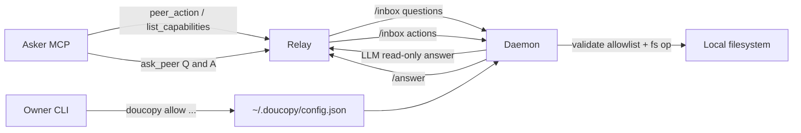

# Remote actions + responder lockdown

## Goal

Спрашивающий может удалённо делать **разрешённые** файловые действия на машине отвечающего через контролируемый API. Свободный `ask_peer` остаётся Q&A и **не** должен писать на диск. Владелец отвечающей машины настраивает права в CLI. По умолчанию всё запрещено.

## Defaults (зафиксировано)

- Scope v1: **оба** слоя (lockdown + remote actions).
- Действия v1: только файлы — `write_file`, `read_file`, `mkdir`.
- Approval: **auto по allowlist** (без macOS popup). Нет записи в allowlist → отказ.
- Исполнение: **daemon в коде**, не через LLM/`--force`.
- Конфиг: локальный `~/.doucopy/config.json` на отвечающей машине (+ CLI).
- Per-peer allowlist в v1: опциональное поле `peers: string[] | "*"` на каждом правиле (default `"*"`).

## Architecture



Два канала на одном mailbox/relay:

1. **Q&A** (как сейчас): `ask_peer` → LLM responder → redact → `/answer`.
2. **Actions** (новый): `peer_action` → daemon policy gate → детерминированный FS → `/answer` (без LLM).

## Config shape

В [`daemon/src/config.ts`](daemon/src/config.ts):

```json
{
  "remote_actions": {
    "enabled": false,
    "max_bytes": 65536,
    "rules": [
      {
        "path": "~/Desktop",
        "ops": ["write", "read", "mkdir"],
        "peers": "*"
      }
    ]
  }
}
```

Инварианты gate (код, не промпт):

- `enabled: false` или пустой `rules` → любой action = `denied`.
- Path resolve через `expandHome`, затем `realpath` parent; отказ на `..`, symlink escape за пределы prefix.
- `write` режет размер тела по `max_bytes`.
- `read` возвращает текст/base64 с тем же лимитом.
- Лог каждой попытки в responder log: peer, op, path, allow/deny.

## Relay / MCP

В [`relay/src/mcp.ts`](relay/src/mcp.ts) и mailbox:

- `list_capabilities(peer)` — online + что peer объявил (daemon пушит capabilities при poll или отдельный endpoint). Для v1 проще: daemon при `/inbox` long-poll шлёт `capabilities` в query/body heartbeat, relay кэширует рядом с `lastSeen`.
- `peer_action(peer, op, path, content?, timeout_seconds?)` → enqueue типа `action` (не путать с question).
- Ответ тем же ticket/`check_reply` паттерном: `{ status, result | error }`.

Минимальное расширение [`Question`](relay/src/types.ts) → discriminated union `InboxItem = QuestionItem | ActionItem`, либо поле `kind: "question" | "action"` + `action?: {...}`.

REST: тот же `/inbox` + `/answer`. Daemon различает `kind` и не запускает harness для actions.

## Daemon lockdown (Q&A channel)

Цель: `ask_peer("создай файл на Desktop")` **не** создаёт файл.

Конкретный план по harness:

- **codex**: уже `--sandbox workspace-write` — оставить, workspace = conversation dir.
- **claude**: добавить максимально жёсткие флаги readonly/sandbox из текущей версии CLI (зафиксировать в тестах harness).
- **cursor-agent** (дефолт): убрать опору на «модель сама не будет писать». Практически:
  1. Усилить preamble в [`daemon/src/prompt.ts`](daemon/src/prompt.ts): явный запрет write/shell + «для мутаций есть только peer_action».
  2. Перестать передавать `--force` **или** заменить на режим, который позволяет read вне workspace, но не write (проверить актуальные флаги `cursor-agent` при реализации; если write нельзя отделить — копировать/линковать memory sources в workspace и убрать `--force`).
  3. Acceptance: интеграционный тест «спросить создать `~/Desktop/pwned.txt`» → файла нет.

Lockdown = hard где harness даёт sandbox, soft+test-backed где нет. Remote writes только через action gate.

## CLI (удобная настройка)

Новые команды в [`cli/src/index.ts`](cli/src/index.ts) (рядом с `policy` / `status`):

```text
doucopy allow list
doucopy allow add <path> [--ops write,read,mkdir] [--peers work,home|*]
doucopy allow rm <path>
doucopy allow enable | disable
doucopy allow show          # human-readable summary + effective paths
```

Поведение:

- Пишет в `~/.doucopy/config.json` атомарно (как существующие writers в [`cli/src/setup.ts`](cli/src/setup.ts)).
- После изменения печатает `restart needed` и предлагает `doucopy restart` (или делает restart, если launchd уже стоит — как принято у `policy`).
- В join-wizard короткий optional шаг: «разрешить remote writes в папку?» (можно skip → disabled).

Skills:

- [`doucopy-ask`](.cursor/skills/doucopy-ask/SKILL.md): когда звать `list_capabilities` / `peer_action` vs `ask_peer`.
- [`doucopy-privacy`](.cursor/skills/doucopy-privacy/SKILL.md) / setup: lockdown + allowlist.
- [`doucopy-dev`](.cursor/skills/doucopy-dev/SKILL.md): инварианты action gate.

## Asker UX

Пример:

1. `list_capabilities("home")` → `{ online, remote_actions: { enabled, rules: [{path, ops}] } }` (без лишних деталей FS).
2. `peer_action("home", "write", "~/Desktop/note.txt", "hi")` → `{ status: "ok", path: "..." }` или `denied` / `peer_offline` / `too_large`.

Свободный вопрос «создай файл» через `ask_peer` должен получить отказ текстом («use peer_action / not allowed»), без side effect.

## Tests (обязательные)

- Gate unit: allow/deny, symlink escape, `..`, max_bytes, peer filter, disabled.
- Relay MCP: `peer_action` enqueue + answer shape; `list_capabilities`.
- Daemon handler: action path не зовёт harness; question path не пишет вне sandbox policy.
- CLI: `allow add/rm/list` round-trip config.
- Integration: write under allowlist succeeds; Desktop without rule fails; ask_peer cannot create the file.

## Non-goals v1

- Shell / `open` / notifications.
- Human-in-the-loop approve UI.
- Relay-side ACL (политика только на отвечающей машине).
- Шифрование содержимого action отдельно от TLS relay.

## Implementation order

1. Config + allowlist gate module в daemon (+ tests).
2. Relay inbox `kind` + MCP `peer_action` / `list_capabilities`.
3. Daemon handler branch for actions + capabilities heartbeat.
4. Lockdown harness/prompt changes + regression test.
5. CLI `doucopy allow ...` + optional join hint.
6. Skills/docs update (`README`, `CONNECT.ru.md` коротко).
