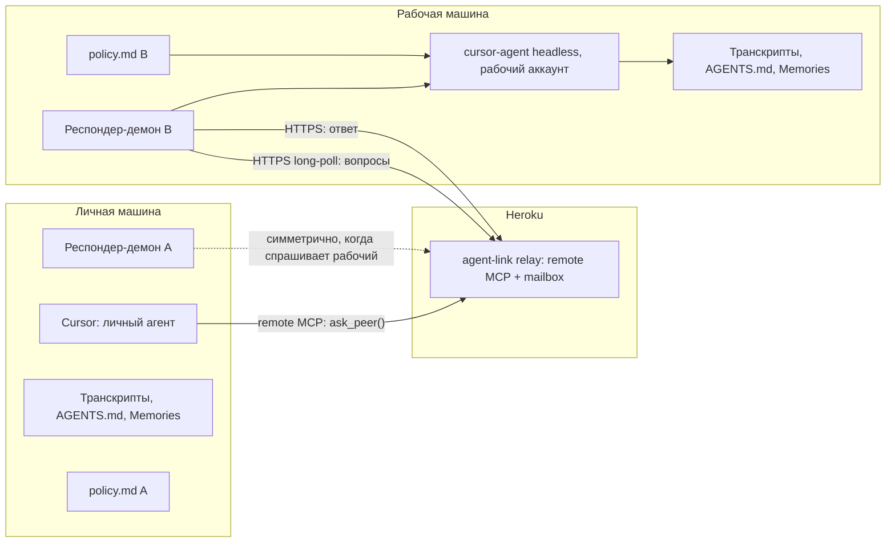
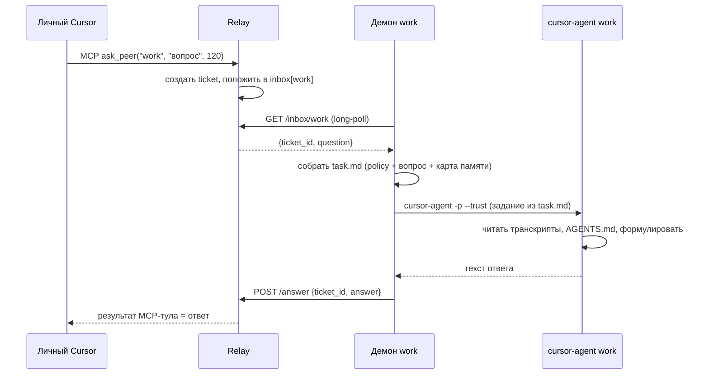

# agent-link: связь двух Cursor-агентов через облачный MCP-релей

Дата: 2026-07-23
Статус: дизайн утверждён, ожидает ревью перед планом имплементации

## 1. Цель и контекст

У пользователя два независимых аккаунта Cursor (личный и рабочий), каждый со своей памятью: транскрипты чатов в `~/.cursor/projects/*/agent-transcripts/*.jsonl`, файлы `AGENTS.md`, встроенные Cursor Memories. Задача: дать агенту одного аккаунта возможность в живом диалоге спросить агента другого аккаунта и получить ответ, сформулированный именно по памяти второго аккаунта.

Пример сценария: агент личного аккаунта задаёт вопрос "что ты знаешь о моих рабочих достижениях за последние полгода?", запускается агент рабочего аккаунта, ищет по своей истории, отвечает.

Связь двусторонняя и симметричная: обе машины могут выступать и спрашивающим, и отвечающим.

## 2. Область MVP

- Только Cursor - Cursor. Расширение на Claude Desktop, ChatGPT и других идёт бесплатно за счёт того, что релей это стандартный remote MCP-сервер, любой клиент с поддержкой remote MCP сможет спрашивать без доработок.
- Одна пара пиров: `personal` и `work`. Модель данных поддерживает N пиров, но конфиг MVP описывает двух.
- Живой диалог (модель "live-agent"): вопрос реально запускает второй `cursor-agent -p` на удалённой машине, а не просто поиск по индексу.
- Транспорт: облачный релей на Heroku, обе машины делают только исходящий HTTPS.
- Работает в любой топологии (одна машина/две машины/рабочая машина с ограничениями), потому что не требует ни входящих портов, ни VPN. На машину ставится только демон: Node-скрипт + launchd-plist (Node.js уже нужен для `cursor-agent`, отдельный бинарник не собираем).

## 3. Компоненты



Три единицы кода в одном репозитории:

### 3.1. Релей (Heroku)

Единственная серверная часть. Совмещает две роли:

- **Remote MCP-сервер** (streamable HTTP по спецификации MCP). Клиент (Cursor) подключается один раз, получает три тула:
  - `list_peers()` возвращает список известных пиров и их онлайн-статус.
  - `ask_peer(peer: string, question: string, timeout_seconds?: number, conversation_id?: string)` кладёт вопрос в inbox пира, ждёт ответ до `timeout_seconds` (по умолчанию 120, максимум 240). Возвращает ответ и `conversation_id` (новый, если не был передан), либо `ticket_id`, если время вышло. Повторный вызов с тем же `conversation_id` продолжает ту же сессию отвечающего агента, он помнит предыдущие вопросы.
  - `check_reply(ticket_id: string)` забирает отложенный ответ по тикету, если он появился позже таймаута.

  Ограничение Heroku: роутер обрывает соединение, если сервер молчит 30 секунд. Поэтому ответ MCP-вызова `ask_peer` отдаётся через SSE-стрим (streamable HTTP это поддерживает) с keepalive-пингами каждые 15-20 секунд на всё время ожидания.
- **REST для демонов** (тот же процесс):
  - `GET /inbox/{peer}?wait=25` long-poll, возвращает следующий вопрос или пустой ответ по таймауту. Ожидание 25 секунд, а не 30, чтобы не попадать на 30-секундную границу роутера Heroku.
  - `POST /answer` с телом `{ticket_id, answer, error?}`.
  - `GET /health`.

Хранение: в памяти процесса. Структуры:
- `peers: Map<string, {token_hash, last_seen_at}>` из конфига Heroku при старте.
- `inbox: Map<peer, Queue<Question>>` где `Question = {ticket_id, from_peer, question, conversation_id, created_at, deadline}`. Релей не интерпретирует `conversation_id`, только генерирует его при первом вопросе и прокидывает насквозь, соответствие с сессиями агента хранит демон.
- `pending: Map<ticket_id, {peer, question, created_at, deadline, resolver}>` для координации между MCP-запросом и REST-ответом демона.

TTL вопросов 24 часа. При переполнении inbox (> 100 сообщений на пир) отбрасываем самые старые с ошибкой `overflow` соответствующему спрашивающему.

Аутентификация: bearer-токен в заголовке `Authorization: Bearer <token>` на каждый запрос, и для MCP, и для REST. Один токен на пир, задаётся переменной окружения на Heroku (`PEER_TOKEN_PERSONAL`, `PEER_TOKEN_WORK`). В памяти хранятся хеши (sha256), сравнение постоянного времени.

Стек: Node.js 22 + TypeScript, официальный SDK `@modelcontextprotocol/sdk` для MCP-части, Fastify для REST. Один dyno типа `basic`: демоны поллят постоянно, поэтому `eco` dyno никогда не заснёт и сожжёт ~720 eco-часов в месяц из общего бюджета 1000 на аккаунт, `basic` предсказуемее. Heroku рестартует dyno примерно раз в сутки, значит фактическое время жизни данных в памяти меньше заявленного TTL, это принятое ограничение (см. секцию 6).

### 3.2. Респондер-демон (обе машины)

Один и тот же бинарник, разное имя пира в конфиге. Роль:

1. Long-poll `GET /inbox/{self_peer}` (25 секунд), при 200 получает вопрос.
2. Собирает промпт для `cursor-agent`:
   - Содержимое `~/.agent-link/policy.md` (фильтр конфиденциальности, редактируется пользователем).
   - Текст вопроса.
   - Карта источников памяти: пути к `~/.cursor/projects/*/agent-transcripts/*.jsonl`, найденные `AGENTS.md` в известных проектах, инструкция читать Cursor Memories через доступные средства (в MVP: ссылка на файл, если пользователь экспортировал их локально, иначе агент обходится транскриптами и AGENTS.md).
   - Инструкция: искать факты о пользователе за последний период, отвечать связным текстом, не выдумывать, при отсутствии данных честно сказать.
3. Запускает `cursor-agent -p --output-format text --trust --workspace ~/.agent-link/workspace --model <из конфига>` с таймаутом 300 секунд. Модель респондера задаётся только локальным конфигом отвечающей стороны (`responder.model`), спрашивающий на неё не влияет: платит за ответ аккаунт отвечающего, он и выбирает модель. Если поле не задано, используется дефолтная модель аккаунта. Промпт передаётся через временный файл в workspace (не через argv: карта транскриптов может быть большой, а кавычки в вопросе ломают шелл), в аргументе остаётся короткая инструкция "прочитай задание из файла task.md и выполни". Флаг `--trust` обязателен, иначе headless-запуск упрётся в интерактивный вопрос о доверии workspace. Агенту нужно читать транскрипты вне workspace, поэтому на прототипе решаем между `--force` и настройкой permissions, фиксируем в плане имплементации.
4. Многоходовый диалог: демон ведёт таблицу `conversation_id → chatId` в `~/.agent-link/conversations.json`. Первый вопрос беседы: обычный запуск, `chatId` созданной сессии сохраняется (через `cursor-agent create-chat` + `--resume <chatId>`, либо парсингом ID из вывода, уточняется на прототипе). Последующие вопросы с тем же `conversation_id`: запуск `cursor-agent --resume <chatId> -p ...`, агент помнит предыдущие вопросы и ответы этой беседы. Полная памятная инструкция (policy + карта источников) кладётся только в первый task.md беседы, в последующие только policy-напоминание и новый вопрос. Записи старше 7 дней вычищаются.
5. Постит результат `POST /answer` с `ticket_id` из вопроса.
6. При ошибке (таймаут, ненулевой exit, панические ошибки) отправляет `POST /answer` с полем `error` и коротким текстовым описанием, спрашивающая сторона увидит его как результат тула.

Демон запускается через launchd (`~/Library/LaunchAgents/com.agent-link.responder.plist`) с `KeepAlive=true` и `RunAtLoad=true`, переживает перезагрузку.

Ретраи long-poll: при сетевой ошибке экспоненциальный backoff 1s → 2s → 4s → ... → потолок 60s. При 401 backoff до 5 минут и в лог (плохой токен, ретраить бесконечно бессмысленно).

Стек: тот же Node.js + TypeScript, чтобы не дублировать язык.

### 3.3. Конфиг на машине

`~/.agent-link/config.json`:
```json
{
  "relay_url": "https://agent-link.herokuapp.com",
  "self_peer": "personal",
  "token": "<bearer token>",
  "memory_sources": {
    "transcripts_glob": "~/.cursor/projects/*/agent-transcripts/*.jsonl",
    "agents_md_roots": ["~/Documents/dev"],
    "extra_files": []
  },
  "responder": {
    "cursor_agent_binary": "cursor-agent",
    "workspace_dir": "~/.agent-link/workspace",
    "response_timeout_seconds": 300,
    "model": "sonnet-4-thinking"
  }
}
```

`~/.agent-link/policy.md` (пример стартового содержимого, пользователь редактирует):
```
Ты отвечаешь агенту другого моего аккаунта. Отвечай о моих действиях,
достижениях, привычках, целях. Не раскрывай:
- содержимое исходного кода конкретных файлов
- секреты, ключи, токены, пароли
- внутренние названия компаний, клиентов, проектов, если они звучат
  как конфиденциальные
Если сомневаешься, лучше обобщи или откажись отвечать на конкретный
пункт, объяснив причину.
```

Пользователь дополняет `policy.md` своими правилами на каждой машине независимо. Отвечающая сторона всегда применяет свою локальную политику до отправки ответа в релей.

## 4. Поток данных для одного запроса



Если `cursor-agent` не успел за таймаут MCP-тула, `ask_peer` возвращает `{status: "pending", ticket_id}`, ответ хранится в `pending` до 24 часов, спрашивающий агент забирает его тулом `check_reply(ticket_id)`.

Если пир офлайн (нет long-poll от него дольше 60 секунд), релей сразу возвращает из `ask_peer` результат `{status: "peer_offline", ticket_id}` без ожидания, вопрос остаётся в inbox и будет доставлен при появлении демона.

Многоходовый диалог: спрашивающий агент передаёт полученный `conversation_id` в следующие вызовы `ask_peer`, отвечающая сторона продолжает ту же сессию `cursor-agent` через `--resume` и помнит ход беседы. Для пользователя это выглядит как переписка двух агентов в его чате: он пишет "уточни у него ...", его агент задаёт уточняющий вопрос в ту же беседу.

Стоимость: каждая сторона платит за своего агента. Вызов `ask_peer` тратит токены аккаунта спрашивающего как обычный tool call в его чате. Работа респондера (самая дорогая часть, минуты агентного поиска) списывается с аккаунта отвечающей стороны, поэтому модель респондера выбирает её локальный конфиг. Релей - фиксированные ~7 USD в месяц за Heroku basic dyno, к токенам отношения не имеет.

## 5. Безопасность

- TLS на весь транспорт (Heroku по умолчанию).
- Bearer-токен на пира, sha256-хеши в памяти релея, сравнение постоянного времени.
- Только исходящие HTTPS с обеих машин, входящих портов нет нигде кроме Heroku.
- Токены хранятся в `~/.agent-link/config.json` с правами `0600`, установщик проверяет и правит режим.
- Вопросы и ответы проходят через релей открытым текстом внутри TLS. Для двух своих аккаунтов достаточно, E2E-шифрование не делаем (YAGNI). Протокол его не исключает: можно добавить симметричный ключ, известный только пирам, и шифровать поле `question`/`answer` до отправки в релей.
- Фильтр конфиденциальности: `policy.md` подставляется в промпт респондера на отвечающей стороне до запуска `cursor-agent`. Это мягкий фильтр (LLM может ошибиться), но пользователь явно выбрал такой уровень и оставил возможность дополнять политику на каждой машине.
- Респондер запускается в выделенной рабочей директории `~/.agent-link/workspace`, инструкцией в промпте ограничен только чтением явно перечисленных путей. Жёсткая ОС-песочница в MVP не строится, при желании добавляется отдельным слоем.

## 6. Обработка ошибок

- **Демон офлайн**: `ask_peer` возвращает `peer_offline` с тикетом. Инбокс копит до 24 часов или до 100 сообщений на пир.
- **`cursor-agent` упал или превысил лимит времени (300s)**: демон постит `POST /answer` с `error`, спрашивающий агент видит текст ошибки как результат тула.
- **Релей перезапустился** (Heroku dyno cycle): при хранении в памяти незакрытые тикеты теряются. Приемлемо для MVP, спрашивающий переспросит. Если начнёт мешать, переносим `pending` и `inbox` в Postgres addon (без изменения интерфейса).
- **Невалидный токен**: релей возвращает 401. Демон делает backoff до 5 минут и логирует, не ретраит бесконечно.
- **Переполнение inbox (>100 на пира)**: самые старые вопросы отбрасываются с ошибкой `overflow` соответствующим `pending`.
- **Перезагрузка машины**: launchd поднимает демона автоматически по `RunAtLoad`.
- **Гонка ticket_id**: `ticket_id = uuidv7()`, уникальный и сортируемый по времени.

## 7. Тестирование

- **Юнит-тесты релея** (`vitest`): очередь inbox с TTL и overflow, long-poll с таймаутом, авторизация, resolve/reject `pending` по `POST /answer`, состояние `peer_offline`.
- **Интеграционный тест демона**: локально поднимается тестовый релей и заглушка `cursor-agent` (bash-скрипт, echo фиксированной строкой), демон гоняет полный цикл inbox → prompt → answer. Проверка обработки таймаута заглушки, ненулевого exit, невалидного токена. Отдельный сценарий на многоходовость: два вопроса с одним `conversation_id`, заглушка проверяет, что второй запуск пришёл с `--resume` и тем же chatId.
- **Ручной e2e MVP**:
  1. Локально: релей, оба демона под разными "пирами" на одной машине, спрашиваю из этого чата через remote MCP, получаю ответ.
  2. Деплой релея на Heroku, конфигурация двух реальных машин, повтор сценария из ТЗ (вопрос о рабочих достижениях).
  3. Тесты граничных случаев: выключить рабочую машину, спросить, увидеть `peer_offline` + `check_reply` после включения.

## 8. Что не входит в MVP (YAGNI-список)

- E2E-шифрование между пирами.
- Постоянное хранилище (Postgres) на релее.
- Веб-интерфейс релея для аудита сообщений.
- Более двух пиров одновременно (хотя протокол это позволяет).
- Другие вендоры (Claude Desktop, ChatGPT) в качестве отвечающей стороны: MVP отвечает через `cursor-agent`. Спрашивать через любой remote MCP клиент уже работает.
- Жёсткая ОС-песочница для `cursor-agent`.
- Автоматический ротатор токенов.

## 9. Открытые вопросы к моменту имплементации

- Точная точка входа в Cursor Memories для отвечающего агента. В MVP полагаемся на транскрипты и `AGENTS.md`, официальный экспорт Memories проверяем на этапе плана. Если экспорт недоступен, оставляем как явное ограничение и документируем.
- Точный формат промпта респондера (шаблон и ограничение длины при большом объёме транскриптов). Будет уточнён в плане имплементации на шаге прототипа респондера.
- Способ дать `cursor-agent` читать транскрипты вне workspace: `--force` или настройка permissions. Решается на прототипе респондера.
- Способ получить `chatId` сессии для `--resume`: `cursor-agent create-chat` заранее или парсинг ID из вывода первого запуска. Решается на прототипе респондера.
